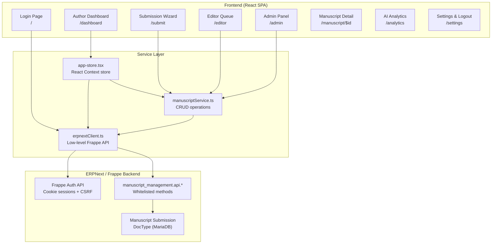
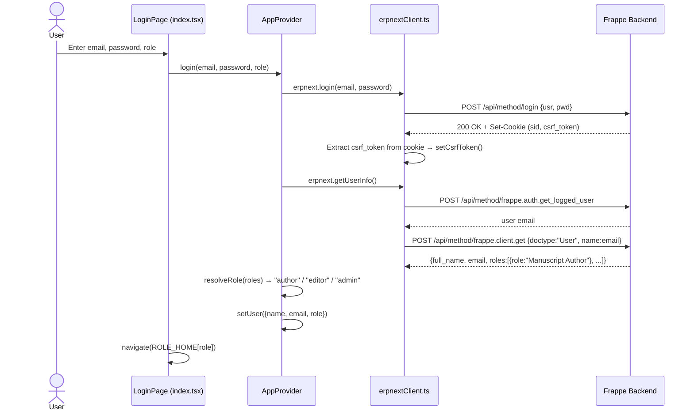
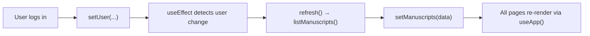
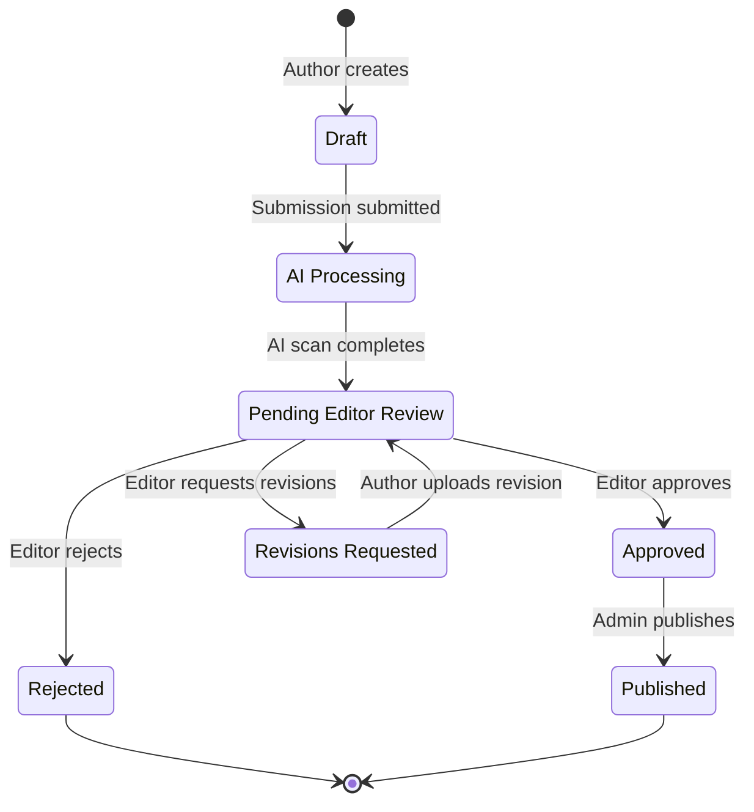

# Manuscript Buddy — Complete Technical Walkthrough

> **Login → Logout**: Every layer, every file, every theory.

---

## 1. Architecture Overview



| Layer | Technology | Purpose |
|-------|-----------|---------|
| **Frontend** | React 19 + TanStack Start + TanStack Router | SPA with file-based routing and SSR |
| **UI Kit** | Radix UI + Tailwind CSS 4 + Lucide icons | Accessible components + utility styling |
| **State** | React Context ([AppProvider](file:///c:/Users/rahul/OneDrive/Booksubmission_grp2/manuscript-buddy/src/store/app-store.tsx#29-122)) | Global user/manuscript state |
| **Forms** | React Hook Form + Zod | Validated forms (editor decision dialog) |
| **Charts** | Recharts | Analytics visualizations |
| **Backend** | Frappe/ERPNext (Docker) | REST API + MariaDB ORM |
| **Database** | MariaDB (InnoDB) | Frappe's default, Docker-managed |
| **Dev Proxy** | Vite `server.proxy` | `/api` → `http://localhost:8080` (avoids CORS) |
| **SSR Runtime** | Nitro (Cloudflare-compatible) | Server-side rendering entry in [server.ts](file:///c:/Users/rahul/OneDrive/Booksubmission_grp2/manuscript-buddy/src/server.ts) |

---

## 2. Authentication Flow (Login → Session)

### 2.1 Login Sequence



### 2.2 Key Technical Details

| Concept | Implementation | File |
|---------|---------------|------|
| **Session** | Cookie-based (`credentials: "include"` on every [fetch](file:///c:/Users/rahul/OneDrive/Booksubmission_grp2/manuscript-buddy/src/server.ts#48-61)) | [erpnextClient.ts:46](file:///c:/Users/rahul/OneDrive/Booksubmission_grp2/manuscript-buddy/src/services/erpnextClient.ts#L44-L53) |
| **CSRF Protection** | `X-Frappe-CSRF-Token` header read from `document.cookie` | [erpnextClient.ts:85-94](file:///c:/Users/rahul/OneDrive/Booksubmission_grp2/manuscript-buddy/src/services/erpnextClient.ts#L85-L94) |
| **Role Resolution** | `"Manuscript Admin"` or `"System Manager"` → admin; `"Manuscript Editor"` → editor; fallback → author | [app-store.tsx:23-27](file:///c:/Users/rahul/OneDrive/Booksubmission_grp2/manuscript-buddy/src/store/app-store.tsx#L23-L27) |
| **Session Persistence** | On mount, [checkSession()](file:///c:/Users/rahul/OneDrive/Booksubmission_grp2/manuscript-buddy/src/store/app-store.tsx#49-65) calls [getUserInfo()](file:///c:/Users/rahul/OneDrive/Booksubmission_grp2/manuscript-buddy/src/services/erpnextClient.ts#167-200) — re-hydrates user if cookie is still valid | [app-store.tsx:48-66](file:///c:/Users/rahul/OneDrive/Booksubmission_grp2/manuscript-buddy/src/store/app-store.tsx#L48-L66) |
| **Error Handling** | [FrappeError](file:///c:/Users/rahul/OneDrive/Booksubmission_grp2/manuscript-buddy/src/services/erpnextClient.ts#24-37) class wraps HTTP status, `_server_messages`, and `exc_type` | [erpnextClient.ts:24-36](file:///c:/Users/rahul/OneDrive/Booksubmission_grp2/manuscript-buddy/src/services/erpnextClient.ts#L24-L36) |

### 2.3 Logout Flow

```
Settings page "Sign out" button
  → calls store.logout()
    → erpnext.logout()
      → POST /api/method/logout  (clears server session)
    → setCsrfToken("")            (clears client token)
    → setUser(null), setManuscripts([])
  → navigate("/")                  (back to login page)
```

Also available via the dropdown menu in [AppShell](file:///c:/Users/rahul/OneDrive/Booksubmission_grp2/manuscript-buddy/src/components/pub/AppShell.tsx#42-134) header.

---

## 3. Role-Based Access Control (RBAC)

### 3.1 Three Roles

| Role | Frontend Key | ERPNext Role(s) | Home Route | Allowed Pages |
|------|-------------|-----------------|------------|---------------|
| **Author** | `"author"` | `Manuscript Author` | `/dashboard` | Dashboard, Submit, Manuscript Detail, Analytics, Settings |
| **Editor** | `"editor"` | `Manuscript Editor` | `/editor` | Review Queue, Manuscript Detail, Analytics, Settings |
| **Admin** | `"admin"` | `Manuscript Admin` / `System Manager` | `/admin` | Admin Panel, Analytics, Settings |

### 3.2 Frontend Route Guard

[AppShell.tsx](file:///c:/Users/rahul/OneDrive/Booksubmission_grp2/manuscript-buddy/src/components/pub/AppShell.tsx) enforces access:

```tsx
// Each page declares: <AppShell allow={["author"]}>
const authorized = !!role && (!allow || allow.includes(role));

useEffect(() => {
  if (!role) navigate({ to: "/", replace: true });       // not logged in → login
  else if (!authorized) navigate({ to: ROLE_HOME[role] }); // wrong role → their home
}, [role, authorized]);
```

### 3.3 Dynamic Navigation

`NAV_BY_ROLE` in [AppShell](file:///c:/Users/rahul/OneDrive/Booksubmission_grp2/manuscript-buddy/src/components/pub/AppShell.tsx#42-134) maps each role to its sidebar links:
- **Author**: Dashboard, New Submission, AI Analytics, Settings
- **Editor**: Review Queue, AI Analytics, Settings
- **Admin**: Admin Panel, AI Analytics, Settings

### 3.4 Backend Permissions

[manuscript_submission.json](file:///c:/Users/rahul/OneDrive/Booksubmission_grp2/manuscript-buddy/erpnext_backend/manuscript_management/manuscript_management/doctype/manuscript_submission/manuscript_submission.json#L233-L258) defines DocType-level permissions:

| Role | Read | Write | Create | Delete |
|------|------|-------|--------|--------|
| System Manager | ✅ | ✅ | ✅ | ✅ |
| Manuscript Author | ✅ | ✅ | ✅ | ❌ |
| Manuscript Editor | ✅ | ✅ | ❌ | ❌ |
| Manuscript Admin | ✅ | ✅ | ✅ | ✅ |

---

## 4. Global State Management

### 4.1 AppProvider Context

[app-store.tsx](file:///c:/Users/rahul/OneDrive/Booksubmission_grp2/manuscript-buddy/src/store/app-store.tsx) — React Context providing:

```typescript
interface AppState {
  user: User | null;          // {name, email, role}
  role: Role | null;          // derived from user
  manuscripts: Manuscript[];  // loaded from backend
  loading: boolean;
  error: string | null;
  login(email, password, role): Promise<void>;
  logout(): Promise<void>;
  refresh(): Promise<void>;   // re-fetches all manuscripts
}
```

### 4.2 Data Flow



- **Single source of truth**: All pages consume [useApp()](file:///c:/Users/rahul/OneDrive/Booksubmission_grp2/manuscript-buddy/src/store/app-store.tsx#123-128) for the same manuscript list
- **Refresh pattern**: After any mutation (submit, decision, state change), call `refresh()` to re-fetch

---

## 5. API Client Layer

### 5.1 erpnextClient.ts — Low-Level Frappe Client

[erpnextClient.ts](file:///c:/Users/rahul/OneDrive/Booksubmission_grp2/manuscript-buddy/src/services/erpnextClient.ts)

| Function | HTTP Call | Purpose |
|----------|----------|---------|
| [login(usr, pwd)](file:///c:/Users/rahul/OneDrive/Booksubmission_grp2/manuscript-buddy/src/services/erpnextClient.ts#114-145) | `POST /api/method/login` | Authenticate, capture CSRF cookie |
| [logout()](file:///c:/Users/rahul/OneDrive/Booksubmission_grp2/manuscript-buddy/src/services/erpnextClient.ts#146-153) | `POST /api/method/logout` | Destroy session |
| [getLoggedUser()](file:///c:/Users/rahul/OneDrive/Booksubmission_grp2/manuscript-buddy/src/services/erpnextClient.ts#154-166) | `POST /api/method/frappe.auth.get_logged_user` | Check active session |
| [getUserInfo()](file:///c:/Users/rahul/OneDrive/Booksubmission_grp2/manuscript-buddy/src/services/erpnextClient.ts#167-200) | [getLoggedUser()](file:///c:/Users/rahul/OneDrive/Booksubmission_grp2/manuscript-buddy/src/services/erpnextClient.ts#154-166) + `frappe.client.get` on User doctype | Get name + roles |
| [call(method, args)](file:///c:/Users/rahul/OneDrive/Booksubmission_grp2/manuscript-buddy/src/services/erpnextClient.ts#98-113) | `POST /api/method/{method}` | Generic whitelisted method call |

**Base URL logic**:
- Dev: `VITE_ERPNEXT_URL=""` → relative paths → Vite proxy forwards to ERPNext
- Prod: Set `VITE_ERPNEXT_URL=https://your.erpnext.site`

### 5.2 manuscriptService.ts — Business Logic

[manuscriptService.ts](file:///c:/Users/rahul/OneDrive/Booksubmission_grp2/manuscript-buddy/src/services/manuscriptService.ts)

| Function | API Method | Purpose |
|----------|-----------|---------|
| [listManuscripts(options)](file:///c:/Users/rahul/OneDrive/Booksubmission_grp2/manuscript-buddy/src/services/manuscriptService.ts#57-71) | `manuscript_management.api.list_manuscripts` | Paginated list |
| [getManuscript(id)](file:///c:/Users/rahul/OneDrive/Booksubmission_grp2/manuscript-buddy/src/services/manuscriptService.ts#83-94) | `manuscript_management.api.get_manuscript` | Single record |
| [createManuscript(payload)](file:///c:/Users/rahul/OneDrive/Booksubmission_grp2/manuscript-buddy/src/services/manuscriptService.ts#126-153) | `manuscript_management.api.create_manuscript` | New submission |
| [updateState(id, state, actor)](file:///c:/Users/rahul/OneDrive/Booksubmission_grp2/manuscript-buddy/src/services/manuscriptService.ts#154-167) | `manuscript_management.api.update_state` | Workflow transition |
| [assignEditor(id, editor, actor)](file:///c:/Users/rahul/OneDrive/Booksubmission_grp2/manuscript-buddy/src/services/manuscriptService.ts#168-179) | `manuscript_management.api.assign_editor` | Admin action |
| [addEditorDecision(id, decision, ...)](file:///c:/Users/rahul/OneDrive/Booksubmission_grp2/manuscript-buddy/src/services/manuscriptService.ts#180-195) | `manuscript_management.api.add_editor_decision` | Approve/revise/reject |
| [uploadRevision(id, fileName, actor)](file:///c:/Users/rahul/OneDrive/Booksubmission_grp2/manuscript-buddy/src/services/manuscriptService.ts#196-207) | `manuscript_management.api.upload_revision` | Re-submit after revisions |
| [generateAIReport(input)](file:///c:/Users/rahul/OneDrive/Booksubmission_grp2/manuscript-buddy/src/services/manuscriptService.ts#95-125) | *Client-side only* | Randomized mock AI scan |
| [sortManuscripts(list, key, dir)](file:///c:/Users/rahul/OneDrive/Booksubmission_grp2/manuscript-buddy/src/services/manuscriptService.ts#41-54) | *Client-side only* | In-memory sorting |

---

## 6. Data Types & Type System

[types.ts](file:///c:/Users/rahul/OneDrive/Booksubmission_grp2/manuscript-buddy/src/services/types.ts)

### 6.1 Core Types

```typescript
type Role = "author" | "editor" | "admin";

type WorkflowState = "Draft" | "AI Processing" | "Pending Editor Review"
  | "Revisions Requested" | "Approved" | "Published" | "Rejected";

interface Manuscript extends ManuscriptBase {
  state: WorkflowState;
  rejectionReason?: string;  // only on RejectedManuscript
}

interface ManuscriptBase {
  id: string;                 // e.g. "MS-00042"
  title: string;
  author: string;
  submittedAt: string;        // ISO datetime
  editor: string | null;
  genre: string;
  secondaryGenre?: string;
  audience?: string;
  keywords: string[];
  abstract?: string;
  synopsis?: string;
  pageCount?: number;
  launchDate?: string;
  fileName?: string;
  fileSize?: number;
  ai: AIReport | null;
  timeline: TimelineEvent[];
  notes: EditorNote[];
}
```

### 6.2 Discriminated Union Pattern

The [Manuscript](file:///c:/Users/rahul/OneDrive/Booksubmission_grp2/manuscript-buddy/src/services/types.ts#90-98) type is a **discriminated union** on the `state` field. This ensures `rejectionReason` is only typed as required when `state === "Rejected"`:

```typescript
type Manuscript =
  | DraftManuscript          // state: "Draft"
  | ProcessingManuscript     // state: "AI Processing"
  | PendingManuscript        // state: "Pending Editor Review"
  | RevisionsRequestedManuscript
  | ApprovedManuscript
  | PublishedManuscript
  | RejectedManuscript;      // includes rejectionReason: string
```

---

## 7. Workflow State Machine

### 7.1 State Transitions



### 7.2 Who Triggers Each Transition

| Transition | Actor | Mechanism |
|-----------|-------|-----------|
| Draft → AI Processing | System | On submission via [createManuscript()](file:///c:/Users/rahul/OneDrive/Booksubmission_grp2/manuscript-buddy/src/services/manuscriptService.ts#126-153) |
| AI Processing → Pending Editor Review | System | After AI scan completes |
| Pending Editor Review → Approved | Editor | [addEditorDecision(id, "approve", ...)](file:///c:/Users/rahul/OneDrive/Booksubmission_grp2/manuscript-buddy/src/services/manuscriptService.ts#180-195) |
| Pending Editor Review → Revisions Requested | Editor | [addEditorDecision(id, "revise", ..., feedback)](file:///c:/Users/rahul/OneDrive/Booksubmission_grp2/manuscript-buddy/src/services/manuscriptService.ts#180-195) |
| Pending Editor Review → Rejected | Editor | [addEditorDecision(id, "reject", ..., feedback, reason)](file:///c:/Users/rahul/OneDrive/Booksubmission_grp2/manuscript-buddy/src/services/manuscriptService.ts#180-195) |
| Revisions Requested → Pending Editor Review | Author | [uploadRevision(id, fileName, ...)](file:///c:/Users/rahul/OneDrive/Booksubmission_grp2/manuscript-buddy/src/services/manuscriptService.ts#196-207) |
| Approved → Published | Admin | [updateState(id, "Published", ...)](file:///c:/Users/rahul/OneDrive/Booksubmission_grp2/manuscript-buddy/src/services/manuscriptService.ts#154-167) |
| Any → Any (force) | Admin | [updateState(id, targetState, ...)](file:///c:/Users/rahul/OneDrive/Booksubmission_grp2/manuscript-buddy/src/services/manuscriptService.ts#154-167) |

### 7.3 Pipeline Visualization

[PipelineTracker.tsx](file:///c:/Users/rahul/OneDrive/Booksubmission_grp2/manuscript-buddy/src/components/pub/PipelineTracker.tsx) renders the **six-step pipeline** using the `WORKFLOW_STATES` array:

```
Draft → AI Processing → Pending Editor Review → Revisions Requested → Approved → Published
```

Each step shows as completed (✓), active (ring), or future (dimmed).

---

## 8. Database Schema (ERPNext DocType)

### 8.1 Main DocType: `Manuscript Submission`

[manuscript_submission.json](file:///c:/Users/rahul/OneDrive/Booksubmission_grp2/manuscript-buddy/erpnext_backend/manuscript_management/manuscript_management/doctype/manuscript_submission/manuscript_submission.json)

| Property | Value |
|----------|-------|
| Autoname | `format:MS-{#####}` (e.g. MS-00001) |
| Engine | InnoDB (MariaDB) |
| Sort Field | `submitted_at` DESC |
| Title Field | `title` |
| Search Fields | `title, author, state` |

**Field groups** (37 total fields):

| Section | Fields |
|---------|--------|
| **Basic** | title, author, state, submitted_at, assigned_editor |
| **Genre & Audience** | genre (Select, 8 options), secondary_genre, audience, keywords |
| **Content Details** | abstract, synopsis, page_count, launch_date |
| **Manuscript File** | manuscript_file (Attach), file_name (read-only), file_size (read-only) |
| **Rejection** | rejection_reason (visible only when state=Rejected) |
| **AI Report** | ai_score, ai_readability, ai_marketability, ai_detected_pages, ai_title_matched, ai_summary, ai_genre_confidence (JSON), ai_pacing (JSON) |
| **Timeline** | timeline_events → child table `Manuscript Timeline Event` |
| **Editor Notes** | editor_notes → child table `Manuscript Editor Note` |

### 8.2 Child Tables

**Manuscript Timeline Event**: `actor` (Data) + `action` (Data) + `timestamp` (Datetime)

**Manuscript Editor Note**: `note_author` (Data) + `created_at` (Datetime) + `body` (Text)

### 8.3 Server-Side Controller

[manuscript_submission.py](file:///c:/Users/rahul/OneDrive/Booksubmission_grp2/manuscript-buddy/erpnext_backend/manuscript_management/manuscript_management/doctype/manuscript_submission/manuscript_submission.py):

```python
class ManuscriptSubmission(Document):
    def before_save(self):
        # Auto-populate submitted_at on first save
        if not self.submitted_at:
            self.submitted_at = frappe.utils.now_datetime()

    def validate(self):
        # Enforce: rejected manuscripts MUST have a reason
        if self.state == "Rejected" and not (self.rejection_reason or "").strip():
            frappe.throw("Rejection reason is required when rejecting a manuscript.")
```

---

## 9. Page-by-Page Breakdown

### 9.1 Login (`/` — [index.tsx](file:///c:/Users/rahul/OneDrive/Booksubmission_grp2/manuscript-buddy/src/routes/index.tsx))

- **Fields**: Email/Username, Password, Role (Select: Author/Editor/Admin)
- **Validation**: Client-side for empty fields + server error display
- **Auto-redirect**: If already logged in (`activeRole` exists), redirect to `ROLE_HOME[role]`
- **Submit**: Calls `store.login()` → navigates on success, shows error on failure

### 9.2 Author Dashboard (`/dashboard` — [dashboard.tsx](file:///c:/Users/rahul/OneDrive/Booksubmission_grp2/manuscript-buddy/src/routes/dashboard.tsx))

- **Guard**: `<AppShell allow={["author"]}>`
- **Stats cards**: Total Submitted, Under Review, Action Required, Published
- **Pipeline tracker**: Shows live status of the first active manuscript
- **Manuscripts table**: Title, Submitted date, State (badge), Editor, AI Score, Actions
- **Actions**: "View Details" (all), "Continue Draft" (Draft state), "Upload Revisions" (Revisions Requested)

### 9.3 Submission Wizard (`/submit` — [submit.tsx](file:///c:/Users/rahul/OneDrive/Booksubmission_grp2/manuscript-buddy/src/routes/submit.tsx))

5 steps with per-step validation:

| Step | Name | Fields | Validation |
|------|------|--------|------------|
| 0 | Title & Category | Title (max 120 chars), Primary Genre, Secondary Genre, Audience, Keywords (tag input) | Title required, genre required, audience required |
| 1 | Description | Abstract (min 5 words), Synopsis, Page Count, Launch Date | Abstract min 5 words, synopsis required |
| 2 | Upload PDF | Drag & drop or click-to-upload, `.pdf` only, max 50MB | File uploaded + 100% complete |
| 3 | Preview & AI Scan | PDF iframe preview + AI preflight report | Auto-generated by [generateAIReport()](file:///c:/Users/rahul/OneDrive/Booksubmission_grp2/manuscript-buddy/src/services/manuscriptService.ts#95-125) (client-side) |
| 4 | Confirm | Summary of all fields + originality checkbox | Checkbox must be checked |

**AI Report** is generated client-side with randomized scores (readability, marketability, pacing, genre confidence). This is a mock/preview; a real ML pipeline would run server-side.

**Final Submit**: Opens confirmation dialog → calls [createManuscript()](file:///c:/Users/rahul/OneDrive/Booksubmission_grp2/manuscript-buddy/src/services/manuscriptService.ts#126-153) → refreshes store → navigates to `/manuscript/$id`.

### 9.4 Manuscript Detail (`/manuscript/$id` — [manuscript.$id.tsx](file:///c:/Users/rahul/OneDrive/Booksubmission_grp2/manuscript-buddy/src/routes/manuscript.$id.tsx))

- **Header**: Title, Status badge, ID, submit date, editor
- **Pipeline tracker**: Six-step progress visualization
- **Three tabs**:
  1. **AI Analysis Report**: Genre confidence bars, pacing bars, readability score, marketability index, AI executive summary
  2. **Workflow Timeline**: Chronological audit log with actor + action + timestamp
  3. **Editor Feedback**: Editor notes list + rejection reason (if any) + revision upload zone (if state = "Revisions Requested")

**Revision upload**: Click-to-upload `.pdf` → calls [uploadRevision()](file:///c:/Users/rahul/OneDrive/Booksubmission_grp2/manuscript-buddy/src/services/manuscriptService.ts#196-207) → refreshes → toast notification.

### 9.5 Editor Queue (`/editor` — [editor.tsx](file:///c:/Users/rahul/OneDrive/Booksubmission_grp2/manuscript-buddy/src/routes/editor.tsx))

- **Guard**: `<AppShell allow={["editor"]}>`
- **Table**: Manuscripts with state `"Pending Editor Review"` or `"AI Processing"`
- **Sortable columns**: Manuscript (by submittedAt), Author, AI Score
- **Pagination**: 5 items per page
- **Make Decision dialog** (Zod-validated form):
  - **Approve**: No extra fields needed
  - **Request Revisions**: Feedback textarea required
  - **Reject**: Rejection reason (Select from predefined list) + explanation textarea, both required
- Calls [addEditorDecision()](file:///c:/Users/rahul/OneDrive/Booksubmission_grp2/manuscript-buddy/src/services/manuscriptService.ts#180-195) → refreshes

### 9.6 Admin Panel (`/admin` — [admin.tsx](file:///c:/Users/rahul/OneDrive/Booksubmission_grp2/manuscript-buddy/src/routes/admin.tsx))

- **Guard**: `<AppShell allow={["admin"]}>`
- **AdminOverview component** (25KB): Pipeline stage breakdown, stats, quick-action cards
- **ManuscriptTable**: Full table of all manuscripts with search, filter, sort
  - **Assign editor**: Dropdown of available editors
  - **Force state**: Advance to any workflow state
  - **Publish**: One-click publish for approved manuscripts
- **ManuscriptDrawer**: Slide-over panel showing full manuscript record

### 9.7 AI Analytics (`/analytics` — [analytics.tsx](file:///c:/Users/rahul/OneDrive/Booksubmission_grp2/manuscript-buddy/src/routes/analytics.tsx))

- **No role restriction** (but AppShell still requires login)
- **Portfolio metrics**: Average AI score, readability, marketability across all scanned manuscripts
- **Per-manuscript bars**: Score percentage visualized with progress bars

### 9.8 Settings (`/settings` — [settings.tsx](file:///c:/Users/rahul/OneDrive/Booksubmission_grp2/manuscript-buddy/src/routes/settings.tsx))

- **Profile card**: Full name, email (from context), active role (read-only)
- **Notifications**: Toggle switches for editor decisions, AI scan completion, publication milestones
- **Sign out button**: Calls [logout()](file:///c:/Users/rahul/OneDrive/Booksubmission_grp2/manuscript-buddy/src/services/erpnextClient.ts#146-153) → navigates to `/`

---

## 10. Frontend Component Architecture

### 10.1 Component Tree

```
RootShell (html, head, body)
└── RootComponent
    ├── QueryClientProvider (TanStack Query)
    └── AppProvider (global state)
        ├── Outlet (child routes)
        └── Toaster (sonner notifications)
```

### 10.2 Key Shared Components

| Component | File | Purpose |
|-----------|------|---------|
| [AppShell](file:///c:/Users/rahul/OneDrive/Booksubmission_grp2/manuscript-buddy/src/components/pub/AppShell.tsx#42-134) | [AppShell.tsx](file:///c:/Users/rahul/OneDrive/Booksubmission_grp2/manuscript-buddy/src/components/pub/AppShell.tsx) | Layout shell with header, nav, user menu, route guard |
| [PipelineTracker](file:///c:/Users/rahul/OneDrive/Booksubmission_grp2/manuscript-buddy/src/components/pub/PipelineTracker.tsx#5-47) | [PipelineTracker.tsx](file:///c:/Users/rahul/OneDrive/Booksubmission_grp2/manuscript-buddy/src/components/pub/PipelineTracker.tsx) | Six-step workflow visualization |
| [StatusBadge](file:///c:/Users/rahul/OneDrive/Booksubmission_grp2/manuscript-buddy/src/components/pub/StatusBadge.tsx#14-27) | [StatusBadge.tsx](file:///c:/Users/rahul/OneDrive/Booksubmission_grp2/manuscript-buddy/src/components/pub/StatusBadge.tsx) | Colored pill badge per workflow state |
| `LoremMark` | [LoremMark.tsx](file:///c:/Users/rahul/OneDrive/Booksubmission_grp2/manuscript-buddy/src/components/pub/LoremMark.tsx) | Brand SVG icon |
| `AdminOverview` | [AdminOverview.tsx](file:///c:/Users/rahul/OneDrive/Booksubmission_grp2/manuscript-buddy/src/components/pub/AdminOverview.tsx) | Dashboard overview for admin with pipeline stats |
| `ManuscriptTable` | admin/ subdirectory | Searchable, filterable admin table |
| `ManuscriptDrawer` | admin/ subdirectory | Slide-over detail panel |

### 10.3 UI Component Library (Radix-based)

All under `src/components/ui/`: Button, Input, Label, Textarea, Select, Checkbox, Switch, Dialog, Tabs, RadioGroup, Progress, Pagination, DropdownMenu, Tooltip, Accordion, etc.

---

## 11. Publishing Metadata Layer

[publishingMeta.ts](file:///c:/Users/rahul/OneDrive/Booksubmission_grp2/manuscript-buddy/src/services/publishingMeta.ts) — Presentation-only derived data:

| Computed Field | Logic |
|----------------|-------|
| **ISBN** | Deterministic from manuscript ID hash: `978-1-XXXX-XXX-X` |
| **ISBN Status** | Published → Assigned, Approved → Reserved, else → Not requested |
| **Pipeline Stage** | Maps [WorkflowState](file:///c:/Users/rahul/OneDrive/Booksubmission_grp2/manuscript-buddy/src/services/types.ts#12-13) → 7 pipeline stages (Submitted → Published) |
| **Proofreading %** | 0–100 based on state advancement |
| **Cover Status** | Not started → In design → In review → Approved |
| **Priority** | AI score ≥ 85 or Approved → High; ≥ 70 → Medium; else → Low |
| **Due Date** | Deterministic offset from current date via hash |

**Pipeline Stages** (expanded from workflow states):
```
Submitted → Assigned → Editing → Review → Proofreading → Design → Published
```

---

## 12. Server-Side Rendering (SSR)

[server.ts](file:///c:/Users/rahul/OneDrive/Booksubmission_grp2/manuscript-buddy/src/server.ts) wraps the TanStack Start server entry:

1. Imports `@tanstack/react-start/server-entry` lazily
2. Forwards all requests through TanStack's SSR handler
3. Catches h3-swallowed 500 errors (JSON `{unhandled: true, message: "HTTPError"}`) and renders a static error page
4. Falls back to `renderErrorPage()` for uncaught exceptions

Error reporting integrates with Lovable's error capture pipeline via [error-capture.ts](file:///c:/Users/rahul/OneDrive/Booksubmission_grp2/manuscript-buddy/src/lib/error-capture.ts).

---

## 13. Dev & Build Configuration

### 13.1 Vite Config

[vite.config.ts](file:///c:/Users/rahul/OneDrive/Booksubmission_grp2/manuscript-buddy/vite.config.ts):

```typescript
export default defineConfig({
  vite: {
    server: {
      proxy: {
        "/api": {
          target: "http://localhost:8080",  // ERPNext Docker
          changeOrigin: true,
          secure: false,
        },
      },
    },
  },
  tanstackStart: {
    server: { entry: "server" },  // → src/server.ts
  },
});
```

### 13.2 Environment Variables

| Variable | Purpose | Default |
|----------|---------|---------|
| `VITE_ERPNEXT_URL` | ERPNext backend URL | `""` (uses Vite proxy in dev) |

### 13.3 Key Scripts

```json
"dev": "vite dev",        // Start dev server
"build": "vite build",    // Production build
"preview": "vite preview"  // Preview production build
```

---

## 14. End-to-End Flow Summary

```
1. LOGIN        → POST /api/method/login → cookie session → CSRF token captured
2. SESSION      → getUserInfo() → role resolved → navigate to role home
3. DASHBOARD    → listManuscripts() → table render → stats computed
4. SUBMIT       → 5-step wizard → createManuscript() → backend saves to MariaDB
5. AI SCAN      → generateAIReport() (client-side mock) → scores attached to submission
6. EDITOR REVIEW → editor views queue → makes decision (approve/revise/reject)
7. REVISIONS    → author uploads new PDF → uploadRevision() → back to editor queue
8. ADMIN CONTROL → assign editor, force state, publish
9. ANALYTICS    → aggregate AI scores across portfolio
10. LOGOUT      → POST /api/method/logout → clear token → redirect to login
```
